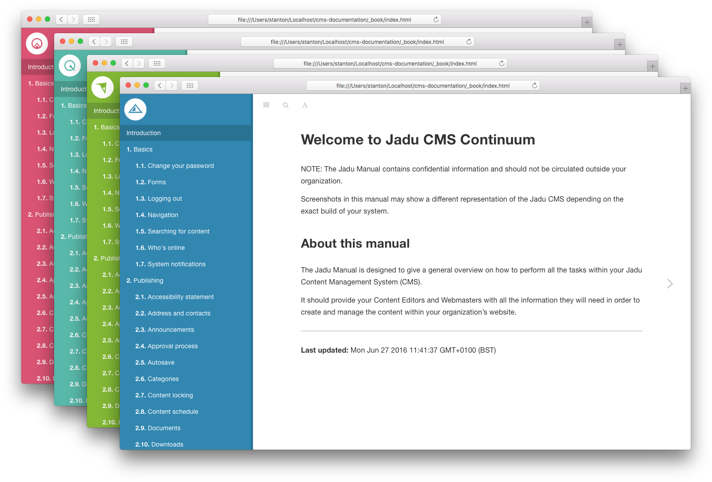

# Gitbook Theme

A Continuum branded theme for Jadu's GitBooks.



## How to use

Add the stylesheet for the relevant Continuum product to your `book.json` file and run `gitbook build`.

### CMS

```
"styles": {
    "website": "assets/continuum/cms.css"
}
```

### XFP

```
"styles": {
    "website": "assets/continuum/xfp.css"
}
```

### CXM

```
"styles": {
    "website": "assets/continuum/cxm.css"
}
```

### CP

```
"styles": {
    "website": "assets/continuum/cp.css"
}
```


